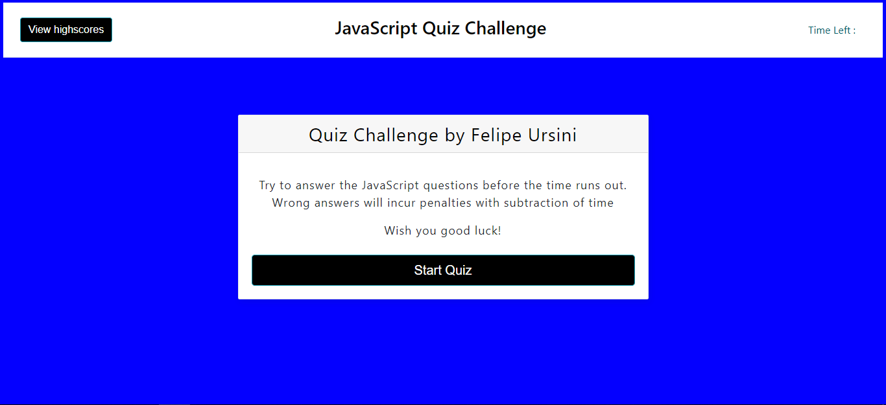
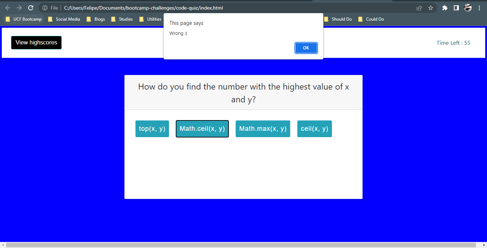
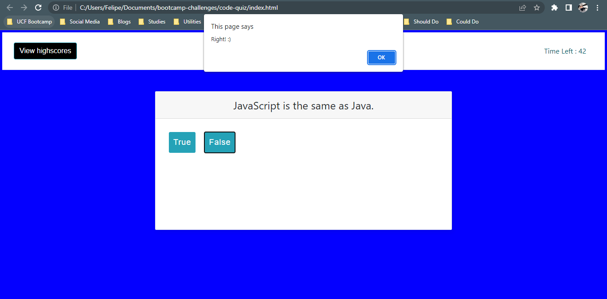
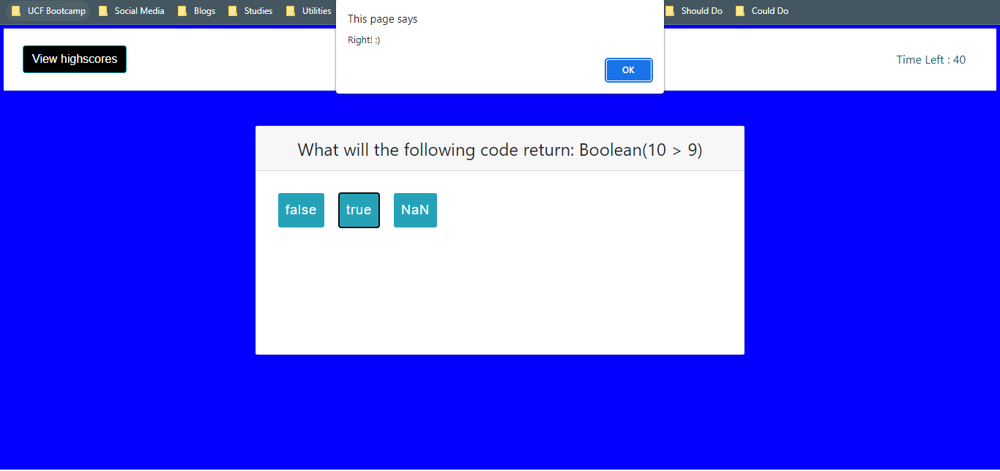
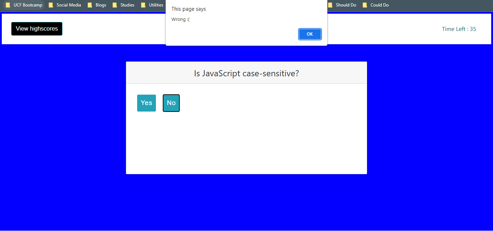
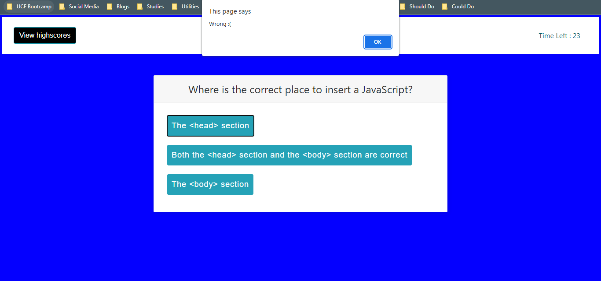
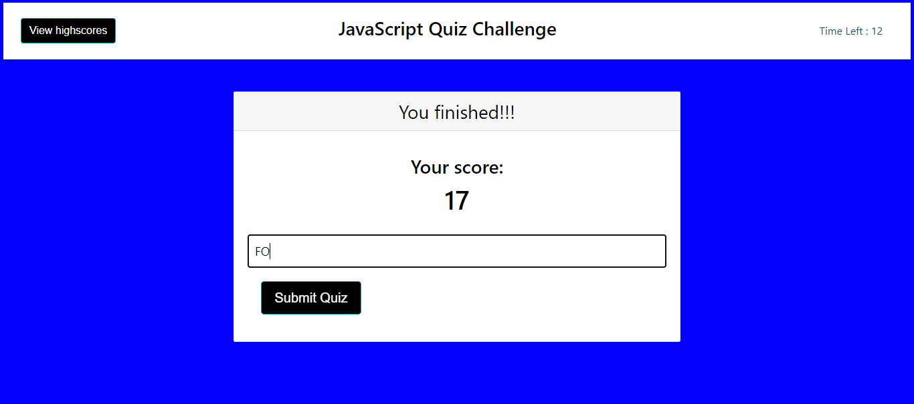
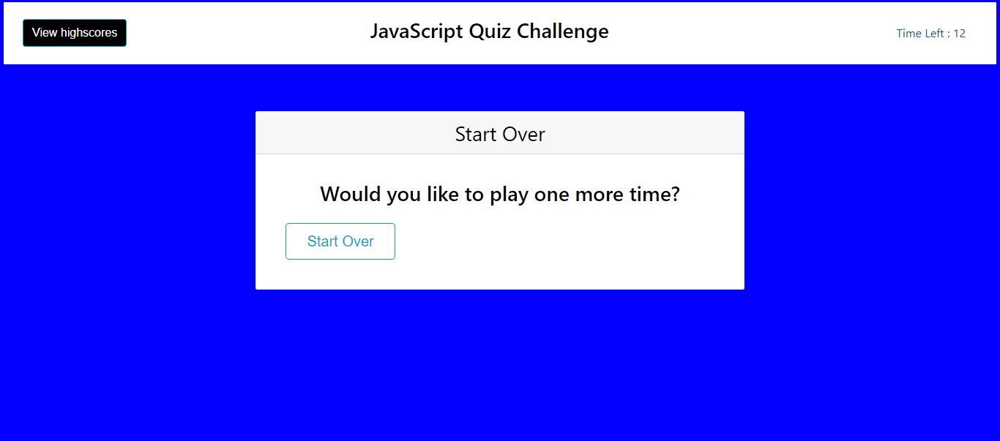
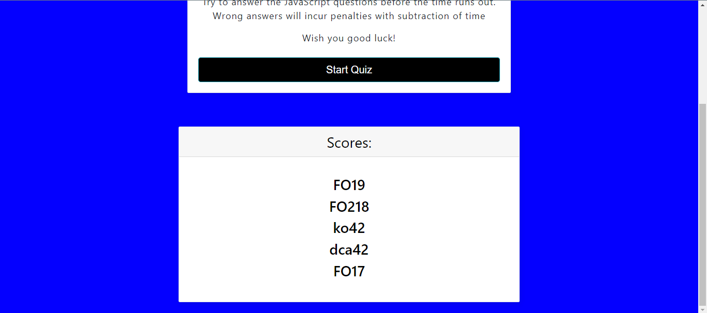

# JavaScript Quiz Challenge

## Description

In this project we had the challenge of making a JavaScript fundamentals quiz that saves the scores locally. The person has to answer the test before the time runs out and each wrong answer is penalized with the subtraction of time

## Deployed Application Link

https://usflfelipe.github.io/javascript-quiz/

## Screenshot

## Contribuitions

* Code made by Felipe Ursini
* I worked in this code with my peer Renan Massini
